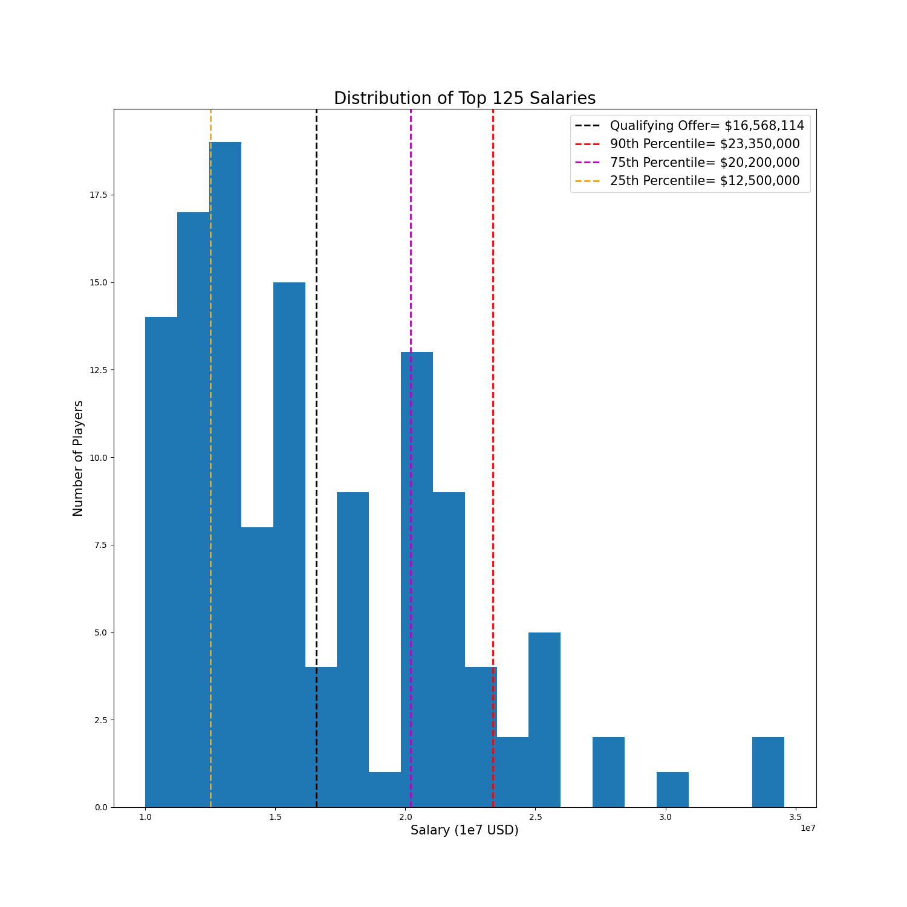
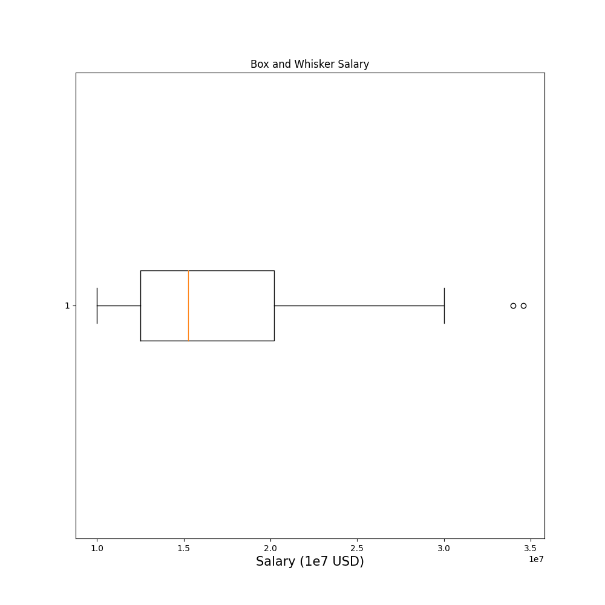

## Part 1
Q. The following Python function checks whether a string is a palindrome. Please explain, in 250 words or less, how you'd improve this code and why. We’re not looking for a simple one-line rewrite here - submissions will be graded based on the clarity by which you describe what the improvements are, and also WHY they should be made.
```python
def is_palindrone(s):
    r=""
    for c in s:
        r = c +r
    for x in range(0, len(s)):
        if s[x] == r[x]:
            x = True
        else:
            return False
    return x
```

### Answer
The largest problem with the above code is the compute time: `O(n^2)`. `is_palindrome` loops through the length of the string twice, once to reverse the string and once to compare the reversed string to the actual string.

Instead, you can create one counter that will increment through the word starting at the beginning and another counter that will decrement through the word starting at the end. The decremented counter will decrement if it is equal to the corresponding character of the incremental counter, otherwise the method will return `False`. If the two counters "meet" in the middle or cross one another, the word is a palindrome.

There are also some smaller, nit-picky issues with the above code:
* The code uses `range` and should probably use `xrange` because it returns a generator. The use of range loads a list equal to the length of the string in memory.
* `x` is defined in the `for` loop and referenced outside the loop, making the scope of x unclear. I’d get rid  of x altogether in this case and just `continue` to the next iteration of the condition is `True`.
* The above code does not account for case or white space. I would call `’Taco cat’` a palindrome (subjectively) but the above code does not.

I would implement with the following code:
```python
import re

def is_palindrome(string):
  ''' Determines whether a string is a palindrome or not.

  Method is case insensitive and ignores white spaces. Returns `True`
  if the string is the same forward and backward, otherwise returns `False`.

  Paramaters
  ----------
  string: str
    The string to be tested
  '''

  new_s = re.sub('\s', '', string).lower()
  j = len(new_s) - 1

  for i, char in enumerate(new_s):
    if j <= i:
      return True

    if char == new_s[j]:
      j -= 1
      continue

    return False
```

#### Palindrome.py
To run the palindrome code, install all dependencies and run the following command on your machine.
`$ python palindrome.py -s="<your_string>"`

**Sample**
```cmd
$ python palindrome.py -s="taco cat"
  True

$ python palindrome.py -s="taco at"
  False
```

## Part 2
Use the provided dataset to write a program or application that determines the monetary value of the upcoming qualifying offer and displays the amount along with any other relevant information or visualizations to the user. Note that while the URL and general format of the data will be consistent, the data itself can change slightly with each page load, so make sure your code pulls the data each time it is run and expect the final result to change each time.

### Answer
**The qualifying offer is $16,619,994.14.**

In order to arrive at the above result, you must run the following command.
```
$ python qualifyingOffer.py
The qualifying offer is $16,811,394.14
```

The command will print the qualifying offer to `stdout`.

Additionally, the script also has options to create and save 2 graphs to the `figures/` directory: `-b, --box-and-whisker` and `-hist, --hist`.

For help running `qualifyingOffer.py` please run:
`$ python qualifyingOffer.py --help`.

If you want to save a histogram and a box and whisker plot, run the following command:
`$ python qualifyingOffer.py -b -hist`

#### Histogram
The histogram also represents the data in a slightly different way. I have labeled the 25th, 75th and 90th percentiles, and could easily add other percentiles.

The purpose for labeling percentiles is to help the finance team decide if they should extend a qualifying offer to Player X. If the organization feels that Player X is in the bottom 25 percent (95-125), they may not want to spend an extra 4 million dollars. By contrast, if the organization feels that the player is in the top 25 percent, they may want to reconsider a low-ball, qualifying offer.


#### Box and Whisker
The below box and whisker plot shows the distribution of the top salaries in the MLB. There are 2 outliers above the 30M dollar mark.

Reading from left to right, the bottom percentile starts at 10M dollars and the 25th percentile is located at the left edge of the box (~ 13M dollars). So, 25 percent of the top 125 players make between 10 million and 13 million dollars. The next 25 percent make between 13 million and 16 million dollars. The median is marked by the red line.

The box contains the 25th to 75th percentile of player salaries, with the right-most whisker representing the 90th percentile.


